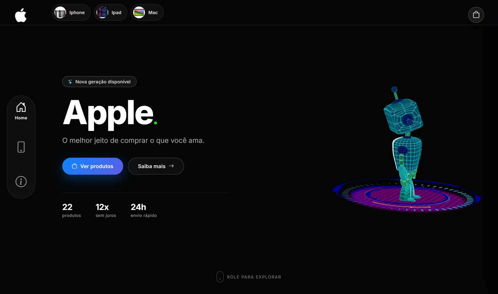
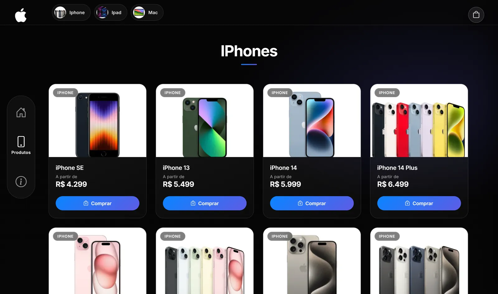
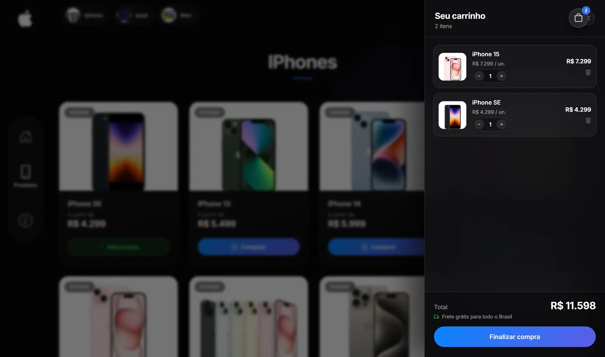

# Apple Store — landing page com Three.js

Landing page inspirada no site da Apple, feita pra estudar WebGL no navegador.
Tem um modelo 3D animado na abertura, uma loja com carrinho funcionando e um
carrossel com efeito de distorção em WebGL.

**[Ver o projeto rodando →](https://projeto-three-js.vercel.app/)**



## O que tem aqui

- **Cena 3D** — modelo `.glb` carregado com GLTFLoader, animação tocando em loop
  pelo AnimationMixer e câmera controlada por OrbitControls.
- **Catálogo** — 22 produtos renderizados a partir de um único array, separados
  por categoria em grades responsivas.
- **Carrinho** — adicionar, alterar quantidade, remover e total em tempo real.
  Abre num painel lateral, fecha no Esc ou clicando fora.
- **Carrossel** — rgbKineticSlider sobre PixiJS, com deslocamento RGB seguindo
  o cursor.
- **Animações de scroll** — GSAP + ScrollTrigger nos elementos de navegação.





## Stack

HTML, CSS e JavaScript puro, sem framework e sem build. Os módulos ES são
carregados direto pelo navegador via `importmap`.

| Biblioteca | Uso |
| --- | --- |
| [Three.js](https://threejs.org/) | cena 3D |
| [GSAP](https://gsap.com/) | animações de entrada e scroll |
| [PixiJS](https://pixijs.com/) | renderização do carrossel |
| [rgbKineticSlider](https://github.com/gerardogrisolini/rgbKineticSlider) | efeito de distorção RGB |
| [Bootstrap Icons](https://icons.getbootstrap.com/) | ícones |

## Estrutura

```
.
├── index.html
├── css/
│   └── style.css
├── js/
│   ├── main.js        decide se monta a cena 3d e importa o three
│   ├── cena.js        three.js: modelo, luz, camera e loop de render
│   ├── catalogo.js    monta os cards e os atalhos de categoria
│   ├── carrinho.js    estado e renderização do carrinho
│   ├── produtos.js    dados dos produtos
│   ├── menu.js        navegação e abertura do carrinho
│   ├── animacoes.js   gsap
│   ├── slider.js      carrega e configura o carrossel
│   └── formato.js     formatador de preço em BRL
├── img/
│   ├── produtos/      fotos do catálogo
│   └── slider/        imagens e mapas de deslocamento do carrossel
├── models/
│   └── robot_playground.glb
├── docs/              capturas usadas neste README
└── vendor/            bibliotecas de terceiros
    ├── three/
    ├── gsap/
    ├── pixi/
    └── rgb-kinetic-slider/
```

## Peso

O modelo veio do Sketchfab com 8.3 MB, quase tudo em keyframes duplicados e
texturas PNG. Passei o [gltf-transform](https://gltf-transform.dev/) pra
reamostrar a animação (276 mil → 68 mil keyframes, mesma duração) e converter as
texturas pra WebP — foi pra 2.7 MB sem mexer na geometria. As fotos do catálogo
também viraram WebP, de 952 KB pra 250 KB, e o Three foi minificado com esbuild
(1.3 MB → 667 KB).

No carregamento: o PixiJS e o TweenMax (158 KB juntos) só entram quando a seção
do carrossel chega perto da tela, e a cena 3D pausa o loop de render quando sai
do viewport ou a aba perde o foco — sem isso o `requestAnimationFrame` fica
queimando CPU a página inteira.

O `main.js` também checa se o navegador tem aceleração por hardware antes de
importar o Three. Sem GPU o Chrome cai no SwiftShader e cada frame passa a
custar ~100 ms de CPU, o que trava a página; nesse caso o hero fica com um fundo
estático e os 263 KB do Three nem chegam a ser baixados. O mesmo vale pra quem
usa `prefers-reduced-motion`.

## Rodando local

Os módulos ES não funcionam abrindo o `index.html` direto no navegador (o
`file://` bloqueia por CORS). Precisa de um servidor:

```bash
npm run dev
```

Ou a extensão Live Server do VS Code.

## Créditos

Modelo 3D `robot_playground.glb` retirado dos exemplos do Three.js.
Projeto feito por estudo, sem vínculo com a Apple.
